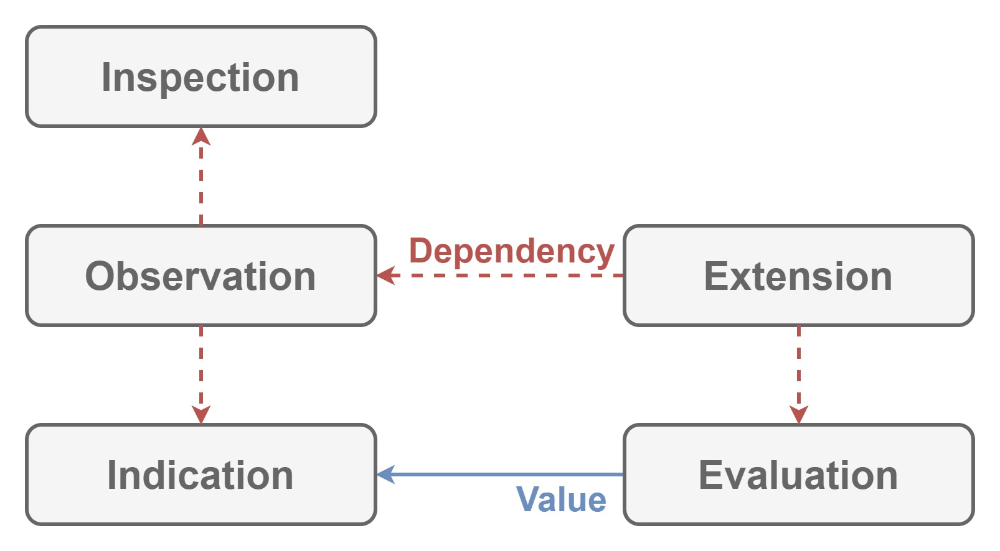

# Elucidation

This module defines how to

- generate
- send
- receive

data for diagnostics in XR applications.

## Dependencies

Nothing.

## Architecture

| Word | Abstraction |
|:-----------|:------------|
| Value | Data for diagnostics. |
| Indication | Receives `Value`. |
| Observation | Sends `Value`. |
| Inspection | Token to send `Value`. |
| Evaluation | Generates `Value`. |

`Indication` indicates `Value`.
`Observation` provides `Inspection` token to send `Value` to `Indication`.
`Inspection` generates `Value` and sends it to `Indication`.

## Implementation

Nothing because this module only defines how to

- generate
- send
- receive

`Value`.
